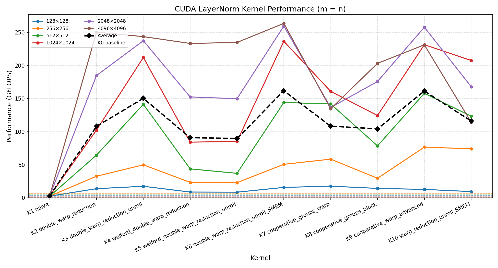

# Fast LayerNorm — CUDA Kernel Optimization

逐步优化 CUDA LayerNorm kernel，从单线程基准出发，依次引入多线程协作规约、Welford 在线算法、共享内存多行复用、Warp Shuffle、向量化加载与 PTX streaming hint，在 4096×4096 矩阵上最终达到基准的 **445×** 加速。

**硬件环境**：NVIDIA GPU，sm_86（Ampere）  
**数据类型**：float32  
**矩阵规模**：方阵 N×N，N ∈ {128, 256, 512, 1024, 2048, 4096}，沿行方向做 LayerNorm

---

## 目录

- [LayerNorm 算法](#layernorm-算法)
- [Kernel 实现与改进](#kernel-实现与改进)
- [性能对比](#性能对比)
- [运行方式](#运行方式)

---

## LayerNorm 算法

对行向量 $x = [x_0, x_1, \dots, x_{H-1}]$，LayerNorm 的数值稳定公式为：

$$\text{LayerNorm}(x_i) = \gamma_i \cdot \frac{x_i - \mu}{\sqrt{\sigma^2 + \varepsilon}} + \beta_i$$

其中：

$$\mu = \frac{1}{H}\sum_j x_j, \qquad \sigma^2 = \frac{1}{H}\sum_j (x_j - \mu)^2$$

$\gamma$（weight）和 $\beta$（bias）是与特征维度等长的可学习参数，按列（特征维度）而非按行（样本）索引——因为它们编码的是"第 $i$ 维特征应有的缩放范围"，与具体样本无关，需跨样本共享才能泛化。

标准实现需要 **2 次遍历（Pass）**：
1. Pass 1：扫描全行，求 $\mu$；再次扫描，求 $\sigma^2$（或用 Welford 算法合并为 1 次）
2. Pass 2：扫描全行，写出归一化结果 $y$

LayerNorm 是典型的 **memory-bound** 操作——每个元素的算术量（减法、乘法、rsqrtf）远少于 HBM 带宽消耗，优化核心在于减少全局内存访问次数和提高访问效率。

> 详细算法推导（Welford 在线算法、BatchNorm vs LayerNorm 对比、反向传播）见 [`docs/algorithm/LayerNorm.txt`](docs/algorithm/LayerNorm.txt)。

---

## Kernel 实现与改进

### K0 — Base（单线程基准）

```
每个线程独立负责一整行，串行执行 2-pass LayerNorm。
```

每行分配 1 个线程，顺序读取、计算、写出，无任何线程协作。访问模式非合并（stride = totalCol），HBM 带宽利用率极低。所有后续 kernel 均以此为对比基准。

---

### K1 — Naive（2D Block）

```
dim3 block(BLOCK_SIZE_X=1024, BLOCK_SIZE_Y=2)：每个 block 处理 2 行，
每行由 1024 个线程协作，每线程负责 totalCol/1024 个元素。
```

**改进**：引入多线程协作，访问模式改为合并访问（连续线程读连续地址）。  
**瓶颈**：无 block 内规约，每线程仍需独立计算自己负责列的局部 sum，最终结果无法在线程间共享——实质上是 K0 的合并访问版，线程并行度提升有限。

---

### K2 — Double Warp Reduction（双级 Warp 规约）

```
dim3 block(BLOCK_SIZE_X=1024, BLOCK_SIZE_Y=2)：1024 线程合力处理一行，
共享内存 reduction[BLOCK_SIZE_Y][32] 存储 warp 间中间结果。
```

**改进**：引入两级 Warp 规约——

- **Level 1**：各 warp 内 `__shfl_xor_sync` 蝶形规约（5 轮），每 warp 的 lane 0 得到本 warp 局部和
- **Level 2**：warp 0 读取所有 warp 的结果（经 SMEM 中转），再做一轮规约得全行和

全体 1024 线程协作处理一行，消除 K1 的局部计算瓶颈，HBM 带宽利用率显著提升。

**瓶颈**：Pass 1（均值）和 Pass 2（方差）各需一次全行遍历，读 GMEM 两次；规约需 2 次 `__syncthreads()`。

---

### K3 — Double Warp Reduction + Unroll

```
在 K2 基础上对主数据循环加 #pragma unroll URF（URF=4）。
```

**改进**：循环展开允许编译器同时发出多条独立 load，增加 MLP（Memory Level Parallelism），隐藏内存延迟。

**实测效果**：提升有限（±5%），原因是 K2 本身已 1024 线程全覆盖，展开后新增的并发 load 对带宽饱和程度改善不大。具体数据见 [`docs/algorithm/unroll_analysis.txt`](docs/algorithm/unroll_analysis.txt)。

---

### K4 — Welford Single Pass（在线算法，单遍读 GMEM）

```
dim3 block(BLOCK_SIZE_X=1024, BLOCK_SIZE_Y=2)：同 K2，
但 Pass1（均值）与 Pass2（方差）合并为一次遍历，使用 Welford 在线算法。
```

**改进**：Welford 批量合并公式每步累加偏差之积 $\delta \cdot \delta'$，同时维护均值和方差，将 GMEM 读取从 2 次降为 1 次，节省约 33% 带宽。

**代价**：内层 Welford 循环含 2 次变量除法（÷count，~25–30 cycle），且规约需同时交换 3 个变量（count/mean/M2），共 15 次 `shfl` vs K2 的 10 次。

**适用区间**：
- N=128（block 数不足，延迟主导）：K4 领先 +13%～+70%
- N≥256，totalCol<4096（带宽+计算共同主导）：K2/K3 领先 -7%～-42%
- totalCol=4096（带宽瓶颈）：两者持平

> 详细分析见 [`docs/algorithm/kernel4_vs_kernel2.txt`](docs/algorithm/kernel4_vs_kernel2.txt)。

---

### K5 — Welford + Unroll

```
K4 + #pragma unroll URF，效果与 K3 vs K2 类似，改善有限。
```

---

### K6 — Multi-Row Block + SMEM（多行 Block，共享内存缓存）

```
dim3 block(BLOCK_SIZE_X_SMEM=256, BLOCK_SIZE_Y_SMEM=2)：
同一 block 同时处理 2 行，weight/bias/A 缓存到动态 SMEM（stride-5 布局）。
```

**改进**：

**多行 Block 提升 SM 利用率（主因）**：K3 的 block 固定 1024 线程处理 1 行，当 totalCol=128 时 1024 线程仅 32 条有效（3% 利用率）。K6 的 block 处理 2 行 × 256 列，同等线程数承担更多有效工作，SM 利用率大幅提升。totalCol 越小提升越显著，n=128 时约 +251%。

**SMEM stride-5 布局避免 bank conflict**：`smemWeight[totalCol/4][5]` 的 stride=5，`gcd(5,32)=1`，32 条线程访问 32 个不同 bank，彻底消除 bank conflict。代价是 SMEM 膨胀 25%（5 vs 4 个元素/组）。

**大 totalCol 时性能下降**：totalCol=4096 时每 block 需 `4 × 1024 × 5 × 2 = 80 KB` 动态 SMEM（含 smemA），接近 sm_86 上限（99 KB），occupancy 下降；同时 BSX=256 线程每轮仍比 BSX=32 有更多并发 load，延迟隐藏更好，但 SMEM 压力抵消部分收益。

**动态 SMEM 三路切分**：

```cpp
extern __shared__ __align__(16) float smem[];
float (*smemWeight)[5] = reinterpret_cast<float(*)[5]>(smem);
float (*smemBias)[5]   = smemWeight + totalCol / 4;
float *smemA           = reinterpret_cast<float*>(smemBias + totalCol / 4);
// flat index: smemA[y * (totalCol/4) * 5 + col * 5 + k]
```

> 详细分析见 [`docs/algorithm/kernel6_vs_kernel3.txt`](docs/algorithm/kernel6_vs_kernel3.txt) 和 [`docs/algorithm/kernel6_smem_multi_row_reduction.txt`](docs/algorithm/kernel6_smem_multi_row_reduction.txt)。

---

### K7 — Cooperative Groups Warp（单 Warp per Row）

```
dim3 block(WARP_SIZE=32, BLOCK_SIZE_Y)：每行恰好由一个 warp（32 线程）处理，
使用 cooperative_groups::coalesced_threads() 做 warp 级规约。
```

**改进**：BSX=32 使每行 warp 内 `cg::reduce` 直接完成一级规约，无需 SMEM 中间缓冲，消除二级规约的 2 次 `__syncthreads()`。小 totalCol（≤256）时 32 线程全部满载（100% 利用率）vs K6 的 12.5%。

**大 totalCol 时下降**：BSX=32 每轮只有 32 线程并发发出 load，而 K6 的 BSX=256 每轮 256 线程并发 load，延迟隐藏效率更高；totalCol=4096 时 BSX=32 需循环 32 轮，BSX=256 只需 4 轮。

---

### K8 — Cooperative Groups Block

```
dim3 block(WARP_SIZE=32, BLOCK_SIZE_Y)：同 K7，
规约作用域改为 block（cooperative_groups::this_thread_block()）。
```

**改进**：在 K7 基础上扩展规约范围到整个 block，统计量广播更高效。实测与 K7 差异有限，部分尺寸略慢（SMEM 同步开销）。

---

### K9 — Cooperative Warp Advanced（PTX Streaming + 全员加载）

```
dim3 block(WARP_SIZE=32, BLOCK_SIZE_Y)：同 K7，
新增：① 全 block 协作加载 weight/bias；② PTX .cs streaming hint；③ x128 向量化。
```

**改进**：

**全员协作加载 weight/bias**：

```cpp
int sidx = (threadIdx.x + WARP_SIZE * threadIdx.y) * x128::size;
for (int i = sidx; i < totalCol; i += blockDim.y * WARP_SIZE * x128::size) {
    s_weight[i / x128::size] = load128(weight + i);   // .ca：缓存到 L1+L2
}
__syncthreads();
```

K7/K8 中 weight/bias 由各 warp 独立从 GMEM（L2）加载；K9 全 block 所有线程分摊加载，加载带宽压力降低 `blockDim.y` 倍。

**PTX Streaming hint（核心收益）**：

```cpp
// A：每行读一次，.cs hint 令数据加载后快速逐出 L1
asm volatile("ld.global.cs.v4.f32 {%0,%1,%2,%3}, [%4];" ...);
// output：写一次即完成，.cs hint 减少 L1 污染
asm volatile("st.global.cs.v4.f32 [%0], {%1,%2,%3,%4};" ...);
```

A 和 output 均为一次性访问，不应长期占用 L1；`.cs` hint 让它们加载/写入后快速逐出，为 weight/bias 等高复用数据腾出 L1 空间，减少 cache 竞争。

**自然对齐 SMEM（vs K10 的 stride-5）**：s_in（等价于 smemA）使用自然对齐，totalCol=4096, BSY=2 时 dynSmem = 64 KB，低于 K10 的 80 KB，occupancy 更高。

> 详细对比见 [`docs/algorithm/kernel9_vs_kernel6.txt`](docs/algorithm/kernel9_vs_kernel6.txt)。

---

### K10 — Warp Reduction + Unroll + SMEM（stride-5 布局）

```
dim3 block(WARP_SIZE=32, BLOCK_SIZE_Y)：同 K9 的单 warp per row，
但沿用 K6 的 stride-5 SMEM 布局（smemWeight/smemBias/smemA）。
```

**相对 K6 的改进**：

| 对比项 | K6 | K10 |
|--------|----|----|
| block x 维度 | BLOCK_SIZE_X_SMEM = 256 | WARP_SIZE = 32 |
| 规约层数 | 二级（warp→SMEM→warp 0） | 一级（`__shfl_xor_sync`） |
| `reduction[]` 静态 SMEM | 需要 | 不需要 |
| 规约处 `__syncthreads()` | 2 次 | 不需要 |
| 小 totalCol 线程利用率 | 12.5%（totalCol=128） | 100% |

**大 totalCol 时落后 K9 的原因**：
1. stride-5 布局使 dynSmem 比 K9 多 25%（80 KB vs 64 KB，totalCol=4096, BSY=2），occupancy 更低
2. 缺少 `.cs` streaming hint，A 和 output 的 L1 cache 污染更严重

> 详细对比见 [`docs/algorithm/kernel10_vs_kernel6.txt`](docs/algorithm/kernel10_vs_kernel6.txt)。

---

### K11 — Double Warp Reduction + SMEM Advanced（全 Block 协作加载）

```
dim3 block(BLOCK_SIZE_X_SMEM=256, BLOCK_SIZE_Y_SMEM=2)：与 K6 相同的 block 结构，
新增：全 block（512 条线程）协作加载 weight/bias，独立于 A 的加载循环。
```

**核心改动**：K6 中 weight/bias 的加载被 `if (threadIdx.y == 0)` 保护，仅 256 条线程参与。K11 引入扁平线程索引，将 block 内全部 512 条线程参与 weight/bias 的预加载：

```cpp
scalar_i flatIdx { threadIdx.y * blockDim.x + threadIdx.x };  // 0..511
scalar_i flatNum { blockDim.y * blockDim.x };                 // 512
for (col = flatIdx; col < totalCol/4; col += flatNum) {
    smemWeight[col][0..3] = load weight[col*4];
    smemBias  [col][0..3] = load bias[col*4];
}
// A 加载循环中无 if 分支
for (col = threadIDX; col < totalCol/4; col += BSX) {
    smemA[...] = load A[row, col];
}
```

**vs K6（修改后）对比**：

| | K6（修改后） | K11 |
|---|---|---|
| weight/bias 加载线程数 | BSX = 256（if 内） | BSX×BSY = 512（独立循环） |
| 每线程循环迭代数（cols=4096） | 4 次（A+weight+bias 融合） | 6 次（2+4，两循环串行） |
| A 加载分支 | if (threadIdx.y==0) | 无分支 |

**与 K6 的性能格局**（平均 GFLOPS 差距仅 +1.3%，无本质区别）：
- 小 rows（≤512）+ 中大 cols：K11 领先最大 +51%（512 线程提高 L2 带宽利用率）
- 大 rows（≥1024）+ 大 cols：K6 持平或略优（K11 多出 2 次循环迭代开销）

**与 K9 的性能格局**：
- K9 BSX=32，totalCol ≤ 512 时线程利用率始终 100%；K11 BSX=256 在 totalCol=128 时仅 12.5% 线程参与 A 加载，4096×128 时 K9 领先 +182%
- totalCol ≥ 1024 时 K11 的 256 线程并发优势使两者趋于持平或 K11 略优

> 详细分析见 [`docs/algorithm/kernel11_weight_bias_load.txt`](docs/algorithm/kernel11_weight_bias_load.txt)。

---

## 性能对比

单位：GFLOPS（越高越好），方阵 m = n  
数据更新：2026-05-26，sm_86，float32

| Size | K0 Base | K1 Naive | K2 DblWarp | K3 Unroll | K4 Welford | K5 Welf+Unroll | K6 SMEM | K7 CG Warp | K8 CG Block | K9 Advanced | K10 Warp+SMEM | K11 SMEM Adv |
|------|--------:|---------:|-----------:|----------:|-----------:|---------------:|--------:|-----------:|------------:|------------:|--------------:|-------------:|
| 128  |     3.2 |      2.6 |        9.7 |      15.3 |        8.7 |            7.4 |    15.8 |       16.5 |        14.7 |        12.8 |          21.8 |         16.9 |
| 256  |     7.2 |      2.9 |       33.3 |      43.0 |       23.4 |           17.3 |    54.9 |       81.0 |        36.0 |        76.7 |          78.3 |         57.3 |
| 512  |     4.8 |      2.5 |       69.0 |     128.0 |       44.1 |           35.7 |   138.9 |      238.0 |        81.4 |       158.0 |         214.2 |        201.3 |
| 1024 |     2.3 |      2.9 |      119.8 |     231.1 |       92.2 |           94.7 |   237.9 |      159.2 |       125.7 |       231.4 |         205.8 |        227.2 |
| 2048 |     1.3 |      3.0 |      186.0 |     257.3 |      151.6 |          160.8 |   257.4 |      137.0 |       172.7 |       257.8 |         169.3 |        256.1 |
| 4096 |     0.6 |      3.1 |      263.2 |     247.5 |      233.8 |          233.0 |   264.5 |      134.8 |       204.7 |       231.2 |         113.8 |        243.6 |

**K6 vs K0（4096×4096）**：264.5 / 0.6 = **441×**

<!-- performance_plot -->

<!-- performance_plot -->

> 虚线为 K0 base reference，与对应维度折线同色。黑色虚线为各 kernel 在所有维度上的平均值（含方阵和非方阵维度）。

### 各阶段关键提升总结

| 改进 | 典型收益 | 主要原因 |
|------|----------|----------|
| K1→K2：多线程规约 | 128×128: +4× | 合并访问 + 全 block 协作 |
| K2→K3：循环展开 | ≤+5% | MLP 提升有限 |
| K3→K6：多行 Block + SMEM | 4096×128: +251% | SM 利用率（小 totalCol） |
| K3→K7：BSX=32 单 Warp | 512×512: +86% | 消除二级规约 + 100% 利用率 |
| K7→K9：PTX .cs hint + 协作加载 | 4096×4096: +80% | L1 cache 竞争减少 |
| K6→K11：全 block weight/bias 加载 | 平均 +1.3%，小rows最大 +51% | 512 线程提高 L2 带宽利用率 |

---

## Python 调用

### 构建 Python 扩展

```bash
cmake -DCMAKE_BUILD_TYPE=Release -G Ninja -S . -B cmake-build-release
ninja -C cmake-build-release -j$(nproc)
# 产物：cmake-build-release/LayerNorm_cuda.cpython-3XX-x86_64-linux-gnu.so
```

### 调用示例

```python
import sys
sys.path.insert(0, "cmake-build-release")
import torch
import LayerNorm_cuda

x = torch.randn(2048, 2048, device="cuda", dtype=torch.float32)
out = LayerNorm_cuda.LayerNorm(x)   # weight=ones, bias=zeros（与 run_kernel.cu 一致）
```

### 与 PyTorch `F.layer_norm` 的性能对比

```bash
# 运行 benchmark（正确性验证 + CUDA Event 计时，重复 100 次）
python benchmark_layernorm.py
```

实测结果（sm_86，float32，median 延迟，2026-05-26）：

| 矩阵规模 | 本项目 (ms) | PyTorch (ms) | 比值 |
|----------|------------:|-------------:|-----:|
| 128×128  |       0.048 |        0.030 | 0.63× |
| 256×256  |       0.047 |        0.029 | 0.61× |
| 512×512  |       0.043 |        0.031 | 0.72× |
| 512×4096 |       0.091 |        0.099 | **1.09×** |
| 1024×4096|       0.167 |        0.194 | **1.16×** |
| 2048×2048|       0.139 |        0.186 | **1.34×** |
| 4096×4096|       0.583 |        0.752 | **1.29×** |

**规律**：小矩阵（rows×cols < 512×1024）时 PyTorch 更快，原因是其底层 kernel 专门针对小尺寸调优（BSX=32、无多行 block 开销）；大矩阵时本项目胜出，最大达 **1.34×**。

---

## 运行方式

### 构建

```bash
cmake -DCMAKE_BUILD_TYPE=Release -G Ninja -S . -B cmake-build-release
ninja -C cmake-build-release -j$(nproc)
```

### 运行 benchmark

```bash
# 运行单个 kernel，结果写入 logs/kernel_{i}.log
./validation <kernel_id>

# 运行并记录所有 kernel（修改 run.sh 中的 seq 范围）
./run.sh
```

### 绘图

```bash
uv run plot_performance.py                        # 默认 6 个方阵维度 + 4 个典型非方阵
uv run plot_performance.py 512 1024 4096          # 指定方阵维度
uv run plot_performance.py --all-sizes            # logs 中全部方阵维度
```

### Python benchmark（与 PyTorch 对比）

```bash
python benchmark_layernorm.py           # 控制台输出 + 追加写入 benchmark_results/
bash benchmark_layernorm.sh             # 同上，日志写入 logs/python_layernorm_test.log
```

### 验证正确性

```bash
./validation <kernel_id>    # 自动与参考实现对比，输出 PASS / FAIL
```
